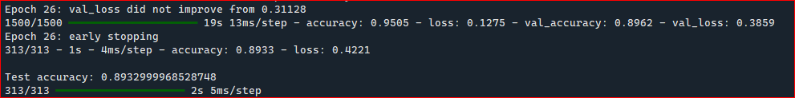
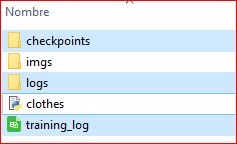
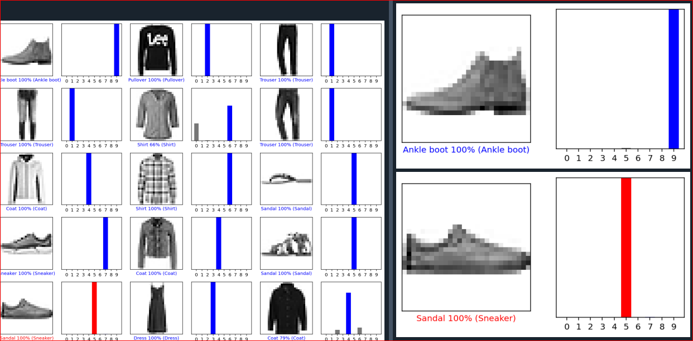

## Classification of each clothes

* **Type of architecture is using for this project**
    The project is using the convolutional neural network.

* **What is the difference between tensorflow webpage than my example?**
    * I using callbacks for to stop the training that helps you to prevent the overfitting.
    * I integrate the tensorboard to the code that are in the callbaks also.
    * I'm using the OOP for the CNN not the api or sequential mode.
    * Is integrated one log with the trainig of each epoch.

## Training process and techniques
    
* **Use early stopping for to pause the trainig & trainig result. Example:**
  
   
* **Folders & files generated are showing in the image. Example:**
  
    
* **Result of the traing & predictions generated. Example:**
  
    
    
    
    