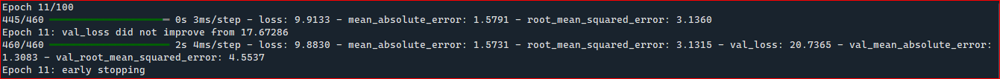
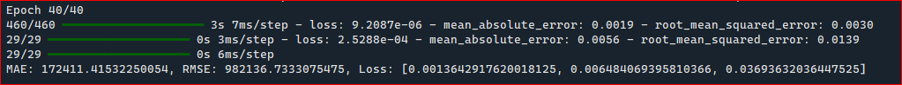

## Price predictions (Price's of the houses)

* **Type of architecture is using for this project**
    The project is using the recurrent neural networks.

* **Why decided to use this type of architecture?**
    The architecture that is using in this project has the 
    propuse of try to predict the prices of the houses in the future.
    The best way way for to make that is using the series of numbers 
    is like try to find what will be the next number with the 
    specific patterns. 
    
* **Problems found during the developing of the proyect**
    The dataset has several fields to the price are equal to zero.
    There aren't special segmentation of the data, example:
    The values of several houses not has labels like segment top,
    medium or low that affects the training. 
    Until you has using embeddings you can't find the correct patterns,
    relations of the data because not exists one relation with the data.
    
* **Why exists two codes in the project?**
    I try to demmonstrate that not exists one way to create a model,
    is necessary to experiment whith several ways for to create a better model 
    or try to experiment with several forms for to find better results.

* **Why you can used or try to replicate this proyect?**
    When i was thinking to replicate this example i'm using techniques like
    stop the model is not learning or improbe with the specific epochs, 
    save the best model, create a log with the traning, you can check the 
    result of the trainig with tensorboard.

## Training process and techniques
    
* **Use early stopping for to pause the trainig. Example:**
  
   
* **Use embeddings for to improve the training with the relation with text and numbers. Example:**
  
    
* **Using the tokenizer method for the conversion the text to numbers, and process the numbers joining the both dataframes. Example:**
  
    
    
    
    